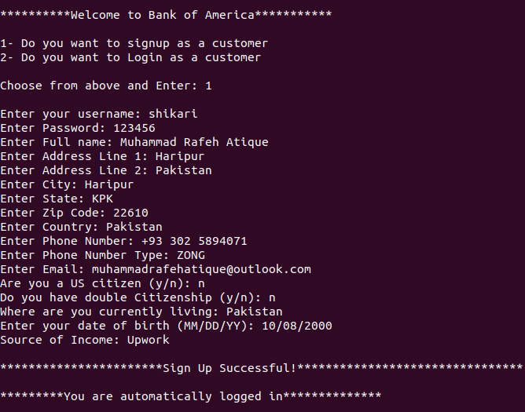
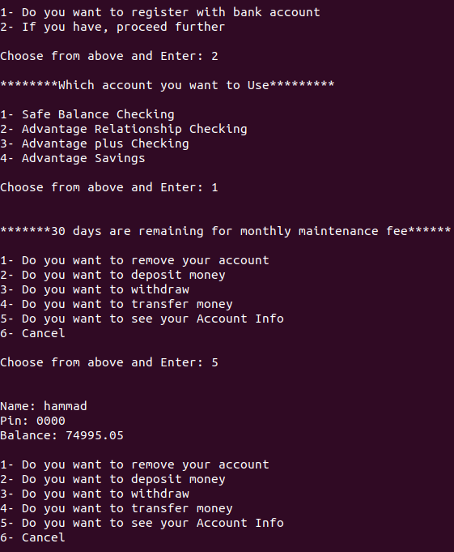

# Virtual-Bank

Virtual bank in python with 4 features/modules i.e Accounts
So, this is a virtual bank in python that has 4 feature/accounts.
Bank can add accounts, delete accounts, withdraw, transaction, transfer,
deduct monthly maintenance fee and a lot of much.
I am using pickle to carry data instead of database.
In metadeta you can find the structure of pickle and a lot of interested stuff.

## Screenshots

  
   

